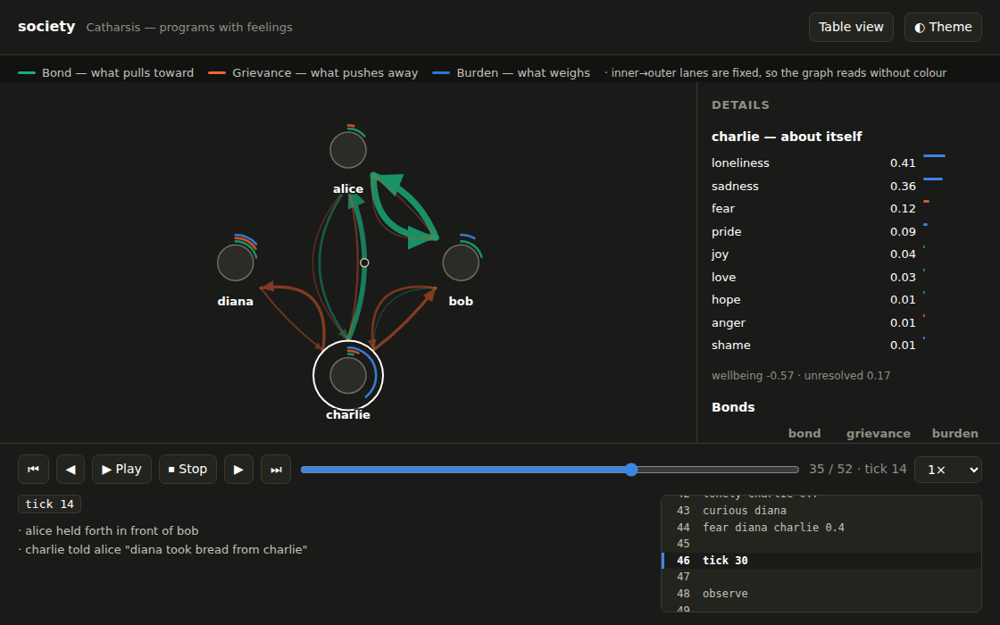
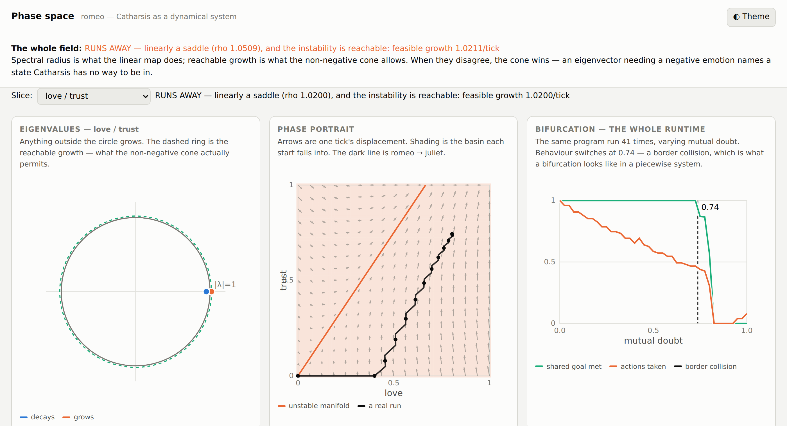

# Catharsis

**Programs with feelings. 💭❤️‍🔥🧠**

[](https://github.com/JGalego/Catharsis/actions/workflows/ci.yml)
[](https://www.python.org/downloads/)
[](LICENSE)
[](pyproject.toml)

Catharsis is an esoteric programming language in which **emotion is the computational
substrate**. Not the syntax — the substrate.

There are no variables. All state lives as *charge* on the edges of a directed graph of
entities: `alice -> bob` carries how Alice feels about Bob, and the self-loop
`alice -> alice` carries how Alice feels about herself. There is no control flow either.
The only thing resembling a statement is `tick`, which advances a simulation in which
emotions feed and drain each other, memories push their charge back into the present,
feeling travels along relationships as hearsay, and every agent takes whichever action
the field is currently pushing it hardest toward.

```
agent alice bob

love alice bob
betray alice bob
grief bob
doubt bob alice
apology alice bob
tick 8
forgive bob alice
```

Nothing above sets a flag. `betray` deposits anger, resentment, doubt and grief on one
edge and guilt on the other, and lays down a memory on both sides. Everything that
follows is the field working — here is what that actually does:

```console
$ catharsis run intro.feel --trace --quiet
[tick 1] alice apologised to bob (landed 14%)
[tick 1] bob confronted alice
[tick 3] bob turned "alice betrayed bob" over again
[tick 4] bob withdrew from alice
[tick 5] alice apologised to bob (landed 17%)
[tick 7] bob turned "alice betrayed bob" over again
[tick 8] bob withdrew from alice
[tick 8] bob forgave alice: 2 memories disarmed, none deleted (trust ceiling 0.75)
```

The program never told Alice to apologise; her guilt outweighed her pride, so she did,
twice, and it landed at 14% because that is how much of an overture gets through the
resentment Bob is holding. Bob was never told to confront her, brood or withdraw. And
forgiving disarmed his memories rather than removing them — the ceiling on how far he can
trust her again is part of the output.

### The same program, in glyphs

Every emotion and the commonest events have a glyph, and a glyph is a *second spelling*,
not a second language — it resolves through the same alias table as `lonely` →
`loneliness`, so no line of the runtime knows the difference. `tests/test_emoji.py`
asserts that: the two spellings of one program produce byte-identical worlds.

```
👤 alice bob        ❤️  love     🤝 trust    🕊️  hope     😄 joy       🦁 pride
                    🔍 curious  🙏 grateful 😠 anger    😨 fear      🤔 doubt
❤️ alice bob         😢 sadness  🖤 grief    🙈 shame    😞 guilt     😒 envy
💔 alice bob         💚 jealousy 🧍 lonely   😲 surprise 🛤️  regret    🧊 resentment
🖤 bob               💔 betray   🙇 apology  🤲 forgive  👁️  witness   🎁 gift
🤔 bob alice         🧠 remember 💭 recall   🙅 deny     🧘 accept    🔀 choice
⏱️ 8                 ⏱️  tick     👤 agent
🤲 bob alice
```

They earn their place a second time on the way out. `--emoji` renders the field in the
same alphabet, which makes a relationship legible at a glance in a way six emotion words
in a row are not:

```console
$ catharsis run examples/emoji.feel --emoji --quiet
carol
  self: 🧍 0.24  😢 0.09
  bonds:
    -> bob: ❤️ 0.78  🤝 0.43  🕊️ 0.33  💚 0.12
    -> alice: 💚 0.26  😠 0.11  😨 0.07
```

## What makes it different from a conventional language

|  | A conventional language | Catharsis |
| --- | --- | --- |
| State | variables you assign | charge on relationships, which decays, couples and spreads |
| Truth | `true` / `false` | four independent stances per memory, and a confidence read off their balance |
| Contradiction | a bug | a quantity: `tension`, which slows the agent holding it |
| The past | data you may choose to read | an active participant: memories push charge back every tick |
| Deletion | `del x` | `grief` — the thing is gone and its afterimage keeps acting |
| Undo | rewind, or restore a snapshot | `regret` — the road not taken stays live and is *valued* beside the one you're on |
| Behaviour | `if` / `else` | every action scored against the field; the strongest one wins |

Three properties fall out of that rather than being implemented:

- **`forgiveness != forgetting`.** `forgive` disarms a memory: it stops pushing anger and
  resentment. It does not delete it, and the memory goes on holding a *ceiling* on how far
  trust can recover.
- **`trust != absence_of_history`.** Trust is clamped by what happened. Forgiving raises
  the ceiling; nothing removes it.
- **Reputation with no reputation table.** Nothing anywhere scores an agent. Witnessing
  puts you in the victim's shoes at 55% strength, confiding hands somebody an actual
  memory believed in proportion to how much they trust you, and contagion leaks feeling
  along every edge — with warnings travelling further than praise. Reputation is what
  those three do together.

Execution is fully deterministic, with no seeded PRNG anywhere: symmetry is broken by a
content hash, so the same program always produces the same world.

## Getting started

### Prerequisites

Python 3.10 or newer. There are no dependencies — the interpreter is stdlib only.

### Installation

```bash
git clone https://github.com/JGalego/Catharsis.git
cd Catharsis
pip install -e .          # optional: puts a `catharsis` command on your PATH
```

Without installing, `python -m catharsis` works identically from the repository root.

### Watching a program run

```bash
catharsis visualize examples/society.feel      # writes examples/society.html
```



A Catharsis program is a field simulation, so a single end-state table is a photograph of
a river. `visualize` writes a standalone HTML file — no dependencies, no network — with a
frame for **every statement and every tick**, play/stop/step/rewind, a scrubber, the source
following along, hover tooltips, and click-to-pin details.

The one real design decision is what an edge means. An entity feels up to twenty things
about another at once, so painting that edge a single colour would throw away exactly what
the runtime exists to model. Instead each ordered pair gets **three arcs in fixed lanes**:

| Lane | Axes |
| --- | --- |
| **Bond** — what pulls toward | love, trust, hope, gratitude, joy, curiosity, pride |
| **Grievance** — what pushes away | anger, resentment, doubt, fear, jealousy, envy |
| **Burden** — what weighs | grief, guilt, shame, sadness, loneliness, regret |

So an ambivalent relationship *looks* ambivalent — two thick arcs side by side, a picture no
net-sentiment score can draw. The lanes never move, so the graph reads without colour at
all, and the twenty individual axes live in the tooltip and the detail panel where identity
belongs.

### Running the interpreter

```bash
catharsis run examples/forgiveness.feel          # run a program and print the final state
catharsis run examples/society.feel --trace      # ...and narrate every event as it happens
catharsis run examples/contradiction.feel --emoji  # ...with one glyph per emotion
catharsis run examples/reputation.feel --json
catharsis check examples/negotiation.feel        # parse without running
catharsis visualize examples/society.feel        # replay it as a graph
catharsis spectrum                               # analyse the field as a dynamical system
catharsis words                                  # everything the language can say
```

Useful flags: `--ticks N` runs extra ticks after the program ends, `--quiet` suppresses the
closing report, `--json` emits the whole world as machine-readable state, `--emoji` renders
the field in glyphs.

### Running an example

```console
$ catharsis run examples/forgiveness.feel --quiet
bob
  self: grief 0.67  sadness 0.55  love 0.25  trust 0.13
  bonds:
    -> alice: love 0.82  trust 0.75  hope 0.72  grief 0.32  gratitude 0.28  surprise 0.26   [trust ceiling 0.75]   [holding: trust/doubt 0.17]
  memories (3):
    "alice betrayed bob"
      confidence: certain (1.00)   emotional_weight: high (1.00)   contradictions: 0
      experienced | forgiven at tick 10   salience 1.00
      still pushing: grief 0.32  doubt 0.22
```

Bob has forgiven Alice. His trust has recovered to exactly the ceiling his memory allows
and no further, the memory is intact and still heavy, and it is still pushing grief — but
no longer anger or resentment. That is the difference between forgiving and forgetting,
and it is a fact about the runtime, not a string.

### Reading the field as a dynamical system

One tick of the field is a linear map followed by a clamp, which means the usual apparatus
applies exactly rather than by simulation. `catharsis spectrum` writes a page with the
eigenvalues, the phase portrait for any pair of axes, the basins and invariant manifolds,
and a bifurcation diagram of the *whole runtime* — the same program run 41 times with one
constant swept.

```bash
catharsis spectrum                                          # the field on its own
catharsis spectrum examples/romeo.feel --edge romeo juliet  # ...with a real run on top
```



The load-bearing idea is the dashed ring in the first panel. Charge cannot be negative, so
an eigenvector with a negative component names a state the runtime has no way to be in, and
the eigenvalue that goes with it describes an instability nothing can reach. **The spectral
radius is therefore the wrong number**; what matters is the fastest growth available inside
the non-negative cone, computed by projected power iteration:

```console
$ catharsis spectrum
the whole field: RUNS AWAY — linearly a saddle (rho 1.0509), and the instability is
                 reachable: feasible growth 1.0211/tick
  what grows: trust +1.00, love +0.62, hope +0.31, jealousy +0.12, resentment +0.07

  slice                      verdict
    love/trust               RUNS AWAY — feasible growth 1.0200/tick
    trust/doubt              HELD BY THE CONE — every growing eigenvector needs a
                             negative emotion, so nothing reaches it
    hope/fear                SETTLES — sink (rho 0.9600)
    grief/sadness            SETTLES — sink (rho 0.9950)
```

That is a claim about the language, and it is falsifiable: exactly one pair of axes is
self-amplifying, and it is the warm one. Every other pair decays to indifference — which is
*why* memories have to exist, because the field alone cannot sustain a grievance. It also
predicts the failure documented in [romeo.feel](examples/romeo.feel) before that example is
run.

The bifurcation panel is the runtime rather than the field, and the distinction matters.
Action selection is an `argmax`, so Catharsis is a **piecewise-affine hybrid system**: its
bifurcations are *border collisions*, a fixed point crossing an action threshold, not the
pitchforks of smooth theory. Sweeping mutual doubt through
[coordination.feel](examples/coordination.feel) finds one at 0.74, where the group stops
being able to act together at all.

### Running the tests

```bash
python -m unittest discover -s tests -v     # 175 tests, no dependencies
ruff check catharsis tests                  # optional: lint
ruff format --check catharsis tests         # optional: formatting
```

## Examples

Every example is a runnable program with its reasoning in the file itself, and
[`examples/README.md`](examples/README.md) collects the resulting state for each one.

| Example | What it shows |
| --- | --- |
| [supply_chain.feel](examples/supply_chain.feel) | **Grounded in a real case.** The XZ Utils backdoor, on its documented timeline. A depleted maintainer, a contributor whose 2.6 years of patches were genuinely good, and two sock puppets applying pressure. Nothing scripts the handover — commit access is a resource, and the runtime grants it when accumulated trust outweighs the exposure. The model runs about twice as fast as the real thing, and that gap is reported rather than tuned out. |
| [commons.feel](examples/commons.feel) | **Grounded in real cases.** The same four fishers, the same stock, run twice — once as neighbours and once as strangers. Neighbours: 0 thefts, the rotation holds. Strangers: 5 thefts, the shared task never gets off zero. Reproduces the direction of Ostrom's finding, including that the advantage outlives the head start. |
| [negotiation.feel](examples/negotiation.feel) | Two agents bargain to a settled price with no negotiation algorithm anywhere. How far each side moves *is* how it feels: `trust + hope + guilt + love + fear` against `pride + anger + resentment + doubt`. Alice's pride wins her the price; Bob's fear loses it — and he ends up holding gratitude and resentment at the same time. |
| [reputation.feel](examples/reputation.feel) | Alice betrays Bob, Charlie sees it, and Diana — who never met Alice and saw nothing — ends up doubting her, via a memory tagged `told \| from charlie` with its own confidence. The damage is strictly graded: victim > witness > hearsay. |
| [forgiveness.feel](examples/forgiveness.feel) | Can Bob forgive Alice without forgetting what she did? Trust recovers to the ceiling the memory imposes and stops there, grief stays, and the memory keeps ruminating with its hostile half disarmed. |
| [unreliable_memory.feel](examples/unreliable_memory.feel) | `recall` returns a confidence, an emotional weight and a contradiction count, never a boolean. `denial` suppresses the claim and the feeling goes on ruminating at full strength anyway. `acceptance` collapses it and charges grief. |
| [society.feel](examples/society.feel) | Four agents, some bread, some temperament, no social algorithm. What emerges over 30 ticks: theft, gossip about the theft, confrontation, withdrawal, charity, and an outsider who ends up allied with the person who fed him — while a fourth agent, equally hungry, is left isolated because nobody is bonded to her. |
| [coordination.feel](examples/coordination.feel) | Three agents and a shared goal with nobody in charge. Alice has enough hope to move first; the gratitude her work produces raises everyone else's trust until they join in, and the goal is met at tick 12. |
| [coordination_broken.feel](examples/coordination_broken.feel) | The same program with the trust graph broken. Nobody can move first, so the gratitude that would have unlocked the others is never generated, and the group never gets off zero. |
| [regret.feel](examples/regret.feel) | `regret` forks rather than rewinds. The untaken road is kept as a live valuation that drifts upward the longer it is carried, so regret grows when the life you are in goes badly and shrinks when it goes well. |
| [emoji.feel](examples/emoji.feel) | A love triangle written entirely in glyphs, with the state rendered back the same way. Carol is told nothing about what to do with her jealousy; she wedges herself into the couple anyway. |
| [contradiction.feel](examples/contradiction.feel) | Love and anger, trust and doubt, hope and fear, all held at once and never collapsed. Action pressure is divided by `1 + tension`, so ambivalence looks like paralysis without anything in the runtime knowing about ambivalence. |
| [romeo.feel](examples/romeo.feel) | **A negative result, kept.** Strogatz's 1988 love-affair model, run five ways. His four regimes do not appear: three of the five setups come out *bit-identical*, because a temperament lives on the self-loop and `_spill` runs one way only. Catharsis has one attractor for a couple, and `catharsis spectrum` says so before the file is run. |
| [sort.feel](examples/sort.feel) | **An actual algorithm.** Sorting integers in two ticks with no comparison operator, no swap, no index, no loop and no actions at all. `_needs` deposits envy on `i -> j` exactly when `v_j > v_i`; `SPILL`'s `envy -> shame` sums those edges into self-regard. **Rank is how many people you have made feel small.** O(1) depth, O(n²) work — enumeration sort, on a machine that happens to have n² edges. |
| [machine.feel](examples/machine.feel) | Whether the language is Turing-complete. `settle` runs until the field goes quiet, which makes an exact unbounded register whose *duration* is a function of the data. Where it stops, and why, is the file's real subject. |

## How it works

```
catharsis/
  field.py       the physics: decay, coupling, spill, antagonism, transmissibility
  vocabulary.py  every word in the language, as a table of charge deposits
  actions.py     every action an agent can take, as affinity and inhibition vectors
  entity.py      bonds, memories, timelines, alternate histories
  world.py       the tick, and the runtime that hangs off those tables
  viz.py         the replay page: three-channel projection, transport, tooltips
  analysis.py    the field as a linear operator: spectra, cones, basins, bifurcations
  phase.py       the phase-space page that draws them
  lexer.py parser.py ast.py errors.py report.py cli.py
```

The design rule is that **emotions do not get `if` statements**. `field.py` and
`actions.py` are data. Adding an emotion means adding a row to a table, and it changes
behaviour everywhere at once because everything — negotiation, gossip, rumination, action
selection — reads the same twenty axes through the same machinery.

One tick, in full: decay → temperament → coupling → spill onto self-regard → rumination →
unmet needs → contagion → regret drift → open bargains → every agent scores every action
and takes the strongest → shared goals check themselves.

Entities are declared by an ordinary utterance, so one line introduces a whole cast:
`agent alice bob carol`, or `👤 alice bob carol`. `alice = agent` is the same thing said
about one entity, kept because it reads better on its own.

`catharsis words` prints the whole vocabulary: twenty emotions, which take either an entity
(`fear diana charlie`), nobody but themselves (`pride charlie`), or a claim
(`doubt alice "the door was open"`), plus the events — `betray`, `apology`, `forgive`,
`witness`, `gift`, `propose`, `reject`, `agree`, `remember`, `recall`, `denial`,
`acceptance`, `choice`, `regret`, `goal`, `have`, `need`, `risk`, `trait`, `group`, `join`.

Time is advanced by `tick n` for a literal number of ticks, or by `settle` — run until
nobody acts, optionally with a safety bound. `settle` is the only statement whose length is
decided by the data rather than by the source, which is what the Turing-completeness
question below turns on.

## What this is not

Catharsis is an esoteric language, and two of the examples are built on documented
real-world cases. The line between them matters: the **sequences** in those examples are
sourced and cited, but the **emotional coefficients are a reading, not a measurement** —
there is no dataset of anyone's trust levels, and there could not be. Where the model
diverges from the record, the example says so instead of adjusting constants until it
agrees. It is a way of arguing about the shape of a process; it does not predict what
particular people will do, and nobody real is named in it.

## Is it Turing-complete?

**Not yet, and the gap is now precise rather than vague.** It used to be trivially not:
every program halted, so halting was decidable. A program is a straight-line list of
statements, `tick n` takes a literal `n`, and there is no loop, conditional or recursion at
the program level.

`settle` removed that. It ticks until nobody acts, with no bound required, so its length is
decided by the data — and `TestSettle` includes a program that provably does not reach a
fixed point inside a budget it is free to exceed. The language is no longer total.

A counter machine needs four things. Three of them are here, and every claim below is a
check in `TestCounterMachine`:

| | |
| --- | --- |
| **An exact unbounded register** | ✅ `give` drains N units in exactly N moves for every N tried. The *duration* is a function of N that appears nowhere in the source, and is worse than linear because the giver habituates. |
| **Decrement, and a branch on zero** | ✅ The action simply stops firing when the register empties, and the agent does something else. |
| **Control flow** | ⚠️ **Two states only.** Two agents and one baton produce an exact alternation — 40 hops, no misfires — with nothing scheduling it: being robbed deposits anger, anger is a term in `_standing`, and standing decides the next theft. *Losing* the baton is what lets you take it back. A program counter in Catharsis is a grudge. |
| **More than two states** | ❌ A ring of three collapses. `compete` deposits anger in the victim toward the taker, and anger is in `compete`'s own affinity, so every transfer creates a back-edge. Control flow here is natively bidirectional — quarrels are two-sided. |

And one agent cannot be a read-write register, though not for the reason it first appears.
The obvious answer — that `give`'s `spare >= 1` and `short > 0` are mutually exclusive — is
wrong, because `compete` has no `need` condition at all and a satisfied agent takes happily.
It just stops after ten. `compete` runs on envy; the only thing in the runtime that *renews*
envy is `_needs`, which manufactures it in whoever is short of the resource; and `give`'s
inhibition vector contains `own_need` at 0.70, keyed on that same shortfall. The thing that
makes incrementing sustainable is the thing that suppresses decrementing. **The mutual
exclusion is between the two pressure sources, not between the two preconditions.**

The missing primitive is one feeling, not a borrowed `goto`: **a need that comes back after
it is met.** `need` is a quota; appetite is not. With a renewing need, `give` becomes a
directed control transfer, and because it leaves gratitude rather than anger it has no
back-edge — `test_a_renewing_need_gives_a_directed_ring` emulates one by hand and gets a
clean three-cycle, one hop per phase. That plus a branch that routes the baton on a
register's value would close it. The second half is still open, and this README will not
claim completeness until there is a construction that runs.

## Status

Version 0.1.0, and deliberately small. The field constants in `field.py` are tuned by hand
and are meant to be argued with — the tests assert properties and inequalities rather than
particular numbers, precisely so the physics can be retuned without lying about what the
language does.

Two things are known to be wrong rather than merely unfinished, and both are documented in
[romeo.feel](examples/romeo.feel) instead of being tuned away:

- **A couple has essentially one attractor.** `catharsis spectrum` shows why: love/trust is
  the only self-amplifying slice of the field, at 1.02 per tick, so mutual attachment is a
  fixed point almost every start falls into. Fixing it is a decision about that loop.
- **Temperament cannot reach a bond.** `_spill` moves outward feeling onto self-regard and
  nothing goes the other way, so a trait can only change a bond by changing which action
  fires. Strogatz's "cautiousness" therefore has no analogue in the bond dynamics at all,
  and `test_temperament_does_not_reach_an_outward_bond` pins that down: two runs differing
  only in temperament come out bit-identical on all twenty axes of the bond.

## License

[MIT](LICENSE).
